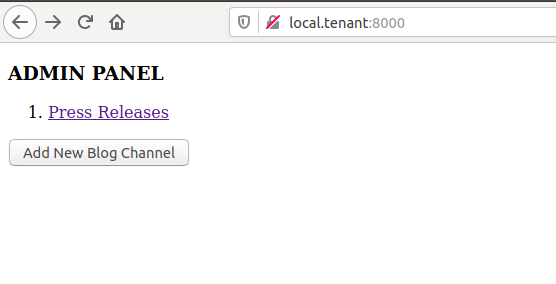
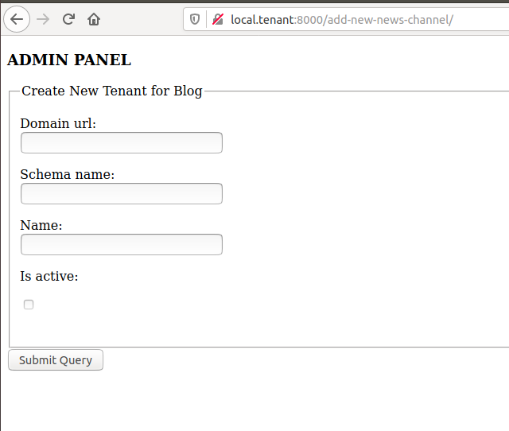
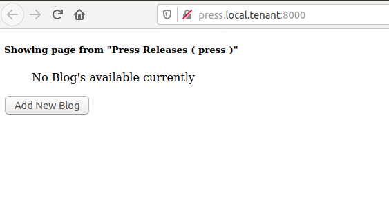
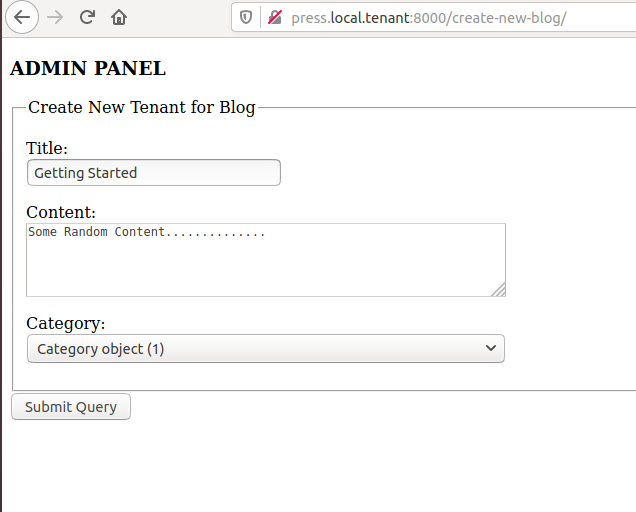

# Django Tenant Schema Demo
Just a demo project which demonstrate django-tenant-schema. 

The project seems to a platform, where admin can create blog websites for his clients.

Project do not want a login unless you want to access django 
default  admin panel. ( facilitating you to test a quick demo.  )
On running `http://local.tenant:8000/` you will access a page to 

If there is an admin, he can ssimpley go to 'http://local.tenant:8000/' ;
    He will get the links of blog websites he already created.
    He can add new Blog Website. which will be and entirely new website with a new domain name or subdomain name. 



*Admin Panel (http://press.local.tenant:8000/)*



*Admin Form (http://local.tenant:8000/add-new-news-channel/)*


If there is sub admin / client for each blog, he can simpley go to 'http://subdomain.local.tenant:8000/' ;
    He will get the links of blogs in his website he already created.
    He can add new Blogs in his  Website. 




*Blog List: (http://press.local.tenant:8000/)*



*Blog Content: (http://press.local.tenant:8000/)*

______________________________________________________________________________________________


#### Steps to follow:
1. Clone the repository.
2. Create a virtualenv
3. create a `.env` file and fill:
    ```
    DB_NAME=tnnt_db
    DB_USER=tnnt
    DB_PASSWORD=password
    DB_HOST=localhost
    ```
4. Edit your hosts file add some subdomains.
   In Ubuntu 
       `sudo nano /etc/hosts`
       ( Windows / Mac users please refer some other tutorial regarding how to edit hosts file. )

    ```
        127.0.0.1       localhost
        127.0.1.1       WebMaster


        # add these hosts anywhere in the file.
        127.0.0.1       local.tenant
        127.0.0.1       abc.local.tenant
        127.0.0.1       blog.local.tenant
        127.0.0.1       news.local.tenant
        127.0.0.1       press.local.tenant


        # The following lines are desirable for IPv6 capable hosts
        ::1     ip6-localhost ip6-loopback
        fe00::0 ip6-localnet
        ff00::0 ip6-mcastprefix
        ff02::1 ip6-allnodes
        ff02::2 ip6-allrouters

    ```

5. pip install -r requirements.txt
6. python manage.py makemigrations
    ```
      Migrations for 'blog':
        apps/blog/migrations/0001_initial.py
          - Create model Category
          - Create model Blog
      Migrations for 'customer':
        apps/customer/migrations/0001_initial.py
          - Create model Client

    ```
7. python manage.py migrate_schemas
    ```
    [standard:public] === Running migrate for schema public
    [standard:public] Operations to perform:
    [standard:public]   Apply all migrations: admin, auth, authtoken, blog, contenttypes, customer, flatpages, 
                      sessions, sites, thumbnail
    [standard:public] Running migrations:
    [standard:public]   Applying blog.0001_initial...
    [standard:public]  OK
    [standard:public]   Applying customer.0001_initial...
    [standard:public]  OK
    ```
   
8. python  manage.py shell
    ```
    from apps.customer.models import Client
    
    tenant = Client(domain_url='local.tenant', schema_name='public', name="Admin Panel", is_active=True)
    tenant.save() 
    
    tenant = Client(domain_url='press.local.tenant', schema_name='press', name="Pess Releases", is_active=True)
    tenant.save()
    ```
    This will result in output :
    ```
    [standard:press] === Running migrate for schema press
    [standard:press] Operations to perform:
    [standard:press]   Apply all migrations: admin, auth, 
    authtoken, blog, contenttypes, customer, flatpages, sessions, sites, thumbnail
    [standard:press] Running migrations:
    [standard:press]   Applying contenttypes.0001_initial...
    [standard:press]  OK
    ...
    ...
    ...
    ...
    [standard:press]   Applying thumbnail.0001_initial...
    [standard:press]  OK
    
    ```
9. python  manage.py tenant_command shell

Enter Tenant Schema ('?' to list schemas): **press**
    ```
    from apps.blog.models import Category
    Category(name="Press Release").save()
    ```
*Repeat this for each tenant!*

10. python manage.py runserver

11. goto 'http://local.tenant'
    
    While adding a new Domain,
    Domain URL, full valid url without http or https .
    eg: `press.local.tenant`, `blog.local.tenant`, `abc.local.tenant`, `news.local.tenant`
    Schema name: (preferrably) `press`, `blog`, `abc`, `news`
    Name : preferrabnle a good name for your webpage.
    Is active. Not used currently.


##### "DATABASE MUST BE PostgreSQL"


###### DO's and DONT's: 
1. Refer [https://github.com/bernardopires/django-tenant-schemas] for all sorts of management commands. 
1. Never use command migrate directly.
1. Refer  [https://django-tenant-schemas.readthedocs.io/en/latest/use.html#migrate-schemas] for migrations.


